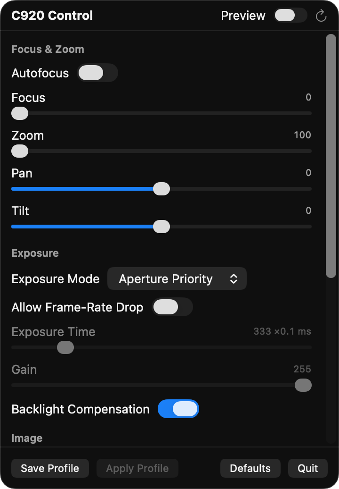

<p align="center">
  
</p>

<h1 align="center">C920 Control</h1>

<p align="center">
  Every setting of the Logitech C920 webcam, from your macOS menu bar.<br>
  Manual focus, exposure, zoom, white balance and more, with a live preview.
</p>

<p align="center">
  <a href="https://github.com/PierreAndreis/c920-control/releases"></a>
  
  
  <a href="LICENSE"></a>
</p>

---

## Why

Logitech's own software on macOS is hit and miss, and the C920's autofocus loves to hunt or lock onto the wrong thing. macOS itself exposes none of the camera's controls. C920 Control talks to the camera directly over USB Video Class (UVC), so you can lock focus, fix exposure and tune the image without installing anything from Logitech. No root, no kernel extensions.

## Features

- **Every standard UVC control** the C920 advertises, read live from the camera with its real range, step and default:
  - Focus & Zoom: autofocus on/off, manual focus, zoom, digital pan and tilt
  - Exposure: mode (manual / aperture priority), exposure time, gain, backlight compensation, frame-rate drop
  - Image: brightness, contrast, saturation, sharpness
  - White balance: auto on/off, color temperature, power line frequency
- **Live preview** inside the popover so you can see what each slider does
- **Profiles**: save your settings once and re-apply them after the camera forgets them (it does, every time it is unplugged or the Mac sleeps deeply)
- **Sensible UI**: controls the camera refuses while an auto mode is on are greyed out; double-click a value to reset it to default
- **Tiny**: a few hundred lines of Swift and Objective-C, no dependencies, no Xcode project

## Install

### Download

Grab `C920-Control-x.y.z.zip` from the [latest release](https://github.com/PierreAndreis/c920-control/releases/latest), unzip, and drop the app into `Applications`. The build is not notarized, so on first launch right-click the app and choose **Open**.

### Build from source

Requires macOS 13 or later and the Xcode command line tools (`xcode-select --install`).

```sh
git clone https://github.com/PierreAndreis/c920-control.git
cd c920-control
./build.sh --install   # builds, copies to ~/Applications and launches
```

macOS asks once for camera access. That is only used for the preview. The controls work without it.

Other build modes:

```sh
./build.sh          # build into ./build only
./build.sh --run    # build and launch from ./build
```

The app is ad-hoc signed by default, so macOS re-asks for camera permission after each rebuild. If you have a signing identity, pass it to keep the permission across rebuilds:

```sh
CODESIGN_IDENTITY="Apple Development: Your Name (TEAMID)" ./build.sh --install
```

## Fixing the focus

1. Click the camera icon in the menu bar and turn **Preview** on.
2. Switch **Autofocus** off.
3. Drag **Focus** while watching the preview. 0 is infinity, 250 is macro. A seated desk distance is usually around 20 to 40.
4. Click **Save Profile**. After the camera is replugged, open the popover and click **Apply Profile**.

## How it works

The C920 is a plain UVC 1.1 device. Each setting is one control on the camera terminal (focus, exposure, zoom, pan/tilt) or the processing unit (brightness, gain, white balance, and so on), and each is read and written with standard class requests on endpoint 0: `GET_CUR`, `GET_MIN`, `GET_MAX`, `GET_RES`, `GET_DEF`, `GET_INFO` and `SET_CUR`.

The catch on modern macOS is that Apple's `UVCAssistant` holds the camera's VideoControl interface exclusively. Anything that tries to claim the interface, such as libusb or pyusb, is refused unless it runs as root. C920 Control sidesteps that by sending the same requests through Apple's `IOUSBHost` framework at the **device** level (`Sources/UVC/UVCDevice.m`). The kernel forwards them to endpoint 0 with the interface as recipient, and the camera answers as usual.

```
Sources/
├── UVC/UVCDevice.m         IOUSBHost transport: one GET and one SET method
└── App/
    ├── Controls.swift      table of every control: entity, selector, size, sign, dependencies
    ├── CameraModel.swift   reads ranges and values, writes changes, profiles, reconnect
    ├── PreviewView.swift   AVFoundation preview of the C920
    └── ContentView.swift   the popover UI
```

## Other cameras

Any UVC webcam should work with two edits:

- the vendor and product IDs in `CameraModel.swift`
- the camera terminal and processing unit entity IDs in `Controls.swift`

Read them from the descriptor with `system_profiler SPUSBDataType` or `ioreg -p IOUSB -l`. Controls a camera does not implement are simply shown as unsettable. Pull requests that make this a picker instead of an edit are welcome.

## Related projects

- [uvc-util](https://github.com/jtfrey/uvc-util): command line UVC control for older macOS
- [uvcc](https://github.com/joelpurra/uvcc): cross-platform UVC control CLI in Node
- [cameractrls](https://github.com/soyersoyer/cameractrls): the Linux equivalent, and a great reference for control semantics

## License

[MIT](LICENSE)
